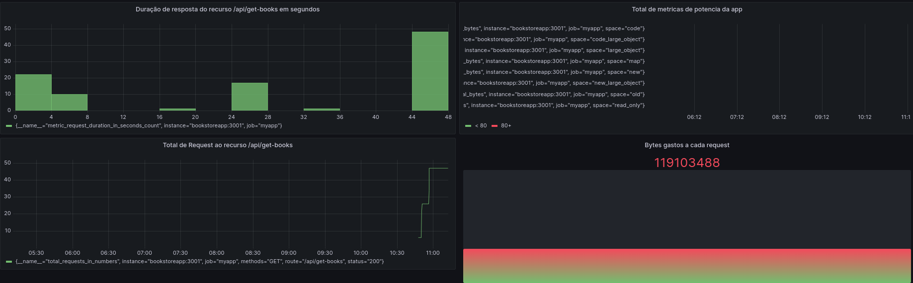

# Proof Of Concepts - Crud with TypeORM using Prometheus + Grafana 

Steps to run this project:

**NOTE: you'll need docker to transform the app into a image (This project create docker volumes)**

1. Run `yarn` command
2. Setup database settings inside `datasource.ts` file
3. Run `docker-compose up --build` to connect with db
4. Run `yarn mig:run` command
5. Run `yarn dev` command to run app
6. Populate your **db** with data, then open grafana in `http://localhost:3000`

Finally, you can access http://localhost/metrics to monitoring the 
endpoint http://localhost/api/get-books (the unique) to create some metrics about.

Here one example of metrics that i made.

